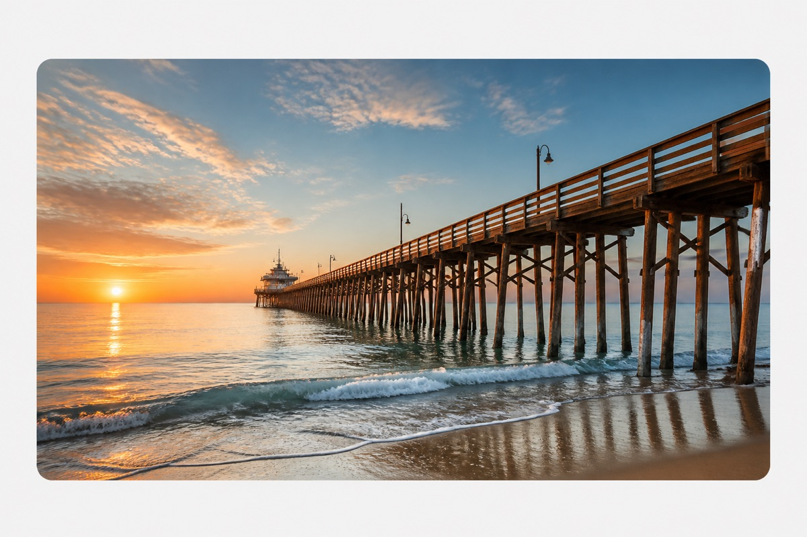
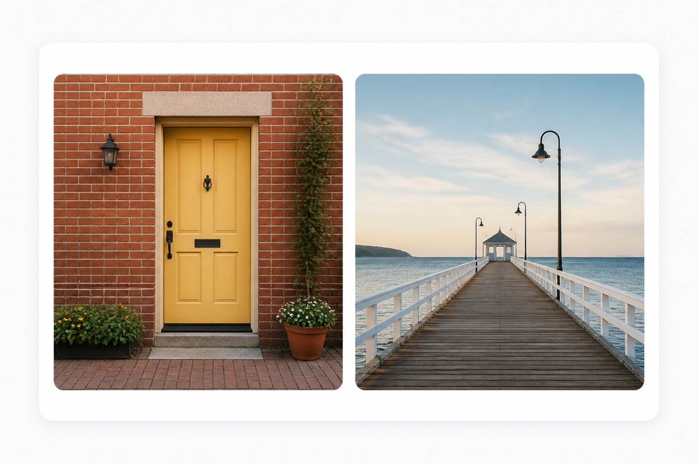
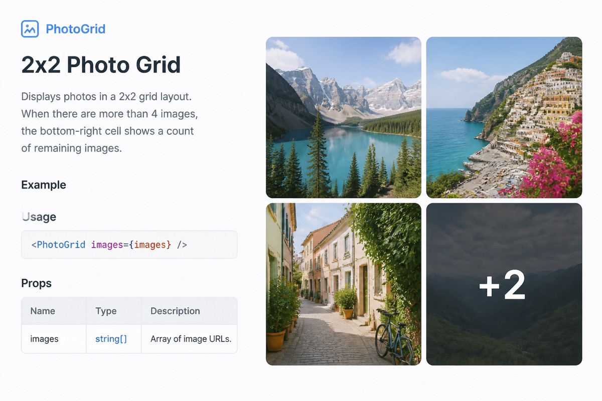

# Examples

Visual examples of `react-native-image-collage` layouts and common integrations.

> Tip: run the playground with `npm run example` to try every layout live.

---

## Layouts at a glance

| Count | Layout | Preview |
|-------|--------|---------|
| **1** | Full width | [Single image](#1-single-image) |
| **2** | Side by side | [Two images](#2-two-images) |
| **3** | Large left + two stacked | [Three images](#3-three-images) |
| **4** | 2×2 grid | [Four images](#4-four-images) |
| **5+** | Grid + `+N` overflow | [Overflow](#5-overflow-n) |

---

## 1. Single image

Full-width tile. Height adapts to aspect ratio when provided (or measured).



```tsx
import { ImageCollage } from "react-native-image-collage";

<ImageCollage
  images={[
    {
      uri: "https://picsum.photos/seed/coast/900/600",
      aspectRatio: 1.5,
    },
  ]}
  spacing={4}
  borderRadius={12}
/>
```

---

## 2. Two images

Equal side-by-side tiles (50 / 50).



```tsx
<ImageCollage
  images={[
    "https://picsum.photos/seed/a/900/700",
    "https://picsum.photos/seed/b/900/700",
  ]}
  spacing={4}
  borderRadius={12}
/>
```

---

## 3. Three images

Facebook-style: one large tile on the left, two stacked on the right.


```tsx
<ImageCollage
  images={photoUrls.slice(0, 3)}
  spacing={4}
  borderRadius={12}
/>
```

---

## 4. Four images

Classic 2×2 grid.


```tsx
<ImageCollage
  images={photoUrls.slice(0, 4)}
  spacing={4}
  borderRadius={12}
/>
```

---

## 5. Overflow (+N)

When there are more images than `maxVisibleImages` (default `4`), the last visible tile shows a `+N` badge.



```tsx
// 6 images → 4 tiles, last tile shows "+2"
<ImageCollage images={sixPhotoUrls} maxVisibleImages={4} />

// 4 images → 3-tile layout, last tile shows "+1"
<ImageCollage images={fourPhotoUrls} maxVisibleImages={3} />
```

**Formula:** `+N = totalImages − maxVisibleImages`

| Total | `maxVisibleImages` | Result |
|------:|-------------------:|--------|
| 5 | 4 | 2×2 grid, `+1` on 4th tile |
| 6 | 4 | 2×2 grid, `+2` on 4th tile |
| 4 | 3 | 3-tile layout, `+1` on 3rd tile |
| 3 | 2 | 2-tile row, `+1` on 2nd tile |

---

## 6. Tap handler

```tsx
<ImageCollage
  images={photoUrls}
  onImagePress={(index) => {
    // 0-based index of the tapped tile
    openViewer(index);
  }}
/>
```

---

## 7. Built-in viewer (React Native CLI)

Requires [`react-native-image-viewing`](https://www.npmjs.com/package/react-native-image-viewing).

```bash
npm install react-native-image-viewing
```

```tsx
import { ImageCollageWithViewer } from "react-native-image-collage/viewer";

<ImageCollageWithViewer
  images={photoUrls}
  spacing={4}
  borderRadius={12}
  viewerProps={{
    swipeToCloseEnabled: true,
    doubleTapToZoomEnabled: true,
    showCloseButton: true,
    showIndexFooter: true,
  }}
/>
```

---

## 8. Expo (blurhash + viewer)

Uses `expo-image`. **No** `react-native-image-viewing` required.

```bash
npx expo install react-native-image-collage expo-image
```

```tsx
import { ImageCollageWithViewer } from "react-native-image-collage/expo";

<ImageCollageWithViewer
  images={photoUrls}
  spacing={4}
  borderRadius={12}
  blurhash="LEHV6nWB2yk8pyo0adR*.7kCMdnj"
  prioritizeFirstImage
  viewerProps={{
    showCloseButton: true,
    showIndexFooter: true,
  }}
/>
```

Collage only (no viewer):

```tsx
import { ImageCollage } from "react-native-image-collage/expo";

<ImageCollage images={photoUrls} blurhash={null} />
```

---

## 9. Your own gallery

```tsx
import { CollageWithViewer } from "react-native-image-collage";

<CollageWithViewer
  images={photoUrls}
  renderViewer={({ images, visible, imageIndex, onRequestClose }) => (
    <MyGallery
      uris={images.map((img) => img.uri)}
      visible={visible}
      initialIndex={imageIndex}
      onClose={onRequestClose}
    />
  )}
/>
```

---

## 10. Custom image renderer (FastImage)

```tsx
import { ImageCollage } from "react-native-image-collage";
import FastImage from "react-native-fast-image";

<ImageCollage
  images={photoUrls}
  renderImage={({ source, style }) => (
    <FastImage
      source={source}
      style={style}
      resizeMode={FastImage.resizeMode.cover}
    />
  )}
/>
```

---

## 11. Local images

```tsx
<ImageCollage
  images={[
    require("./assets/photo1.png"),
    require("./assets/photo2.png"),
  ]}
/>
```

---

## 12. Inside a padded card

Width is measured from the parent via `onLayout` — no manual screen width needed.

```tsx
<View style={{ paddingHorizontal: 16 }}>
  <ImageCollage images={photoUrls} spacing={4} borderRadius={12} />
</View>
```

Optional overrides:

```tsx
<ImageCollage images={photoUrls} width={320} />
<ImageCollage images={photoUrls} height={280} />
```

---

## Image input formats

```tsx
// URL string
"https://example.com/photo.jpg"

// Object with aspect ratio (recommended)
{ uri: "https://example.com/photo.jpg", aspectRatio: 1.5 }

// RN source (local, headers, …)
require("./photo.png")
{ uri: "https://example.com/photo.jpg", headers: { Authorization: "…" } }
```

---

## Capturing real screenshots

See [screenshots.md](./screenshots.md) to replace these previews with captures from your device / simulator.
